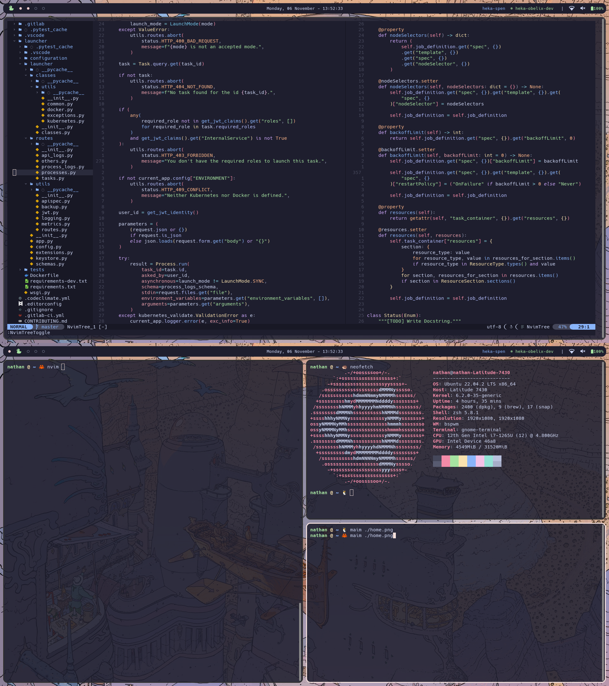

# 🎨 My dotfiles 🖌️

Simple and honest rice made with **BSPWM**, **Polybar** and **Catppuccin** (<3)



Tools: 
- **VM**: Bspwm
- **Bar**: Polybar
- **Terminal**: gnome-terminal (keeping it classy)
- **Editor**: Nvim
- **Color Scheme**: Catppuccin (Mocha)
- **Compositor**: Picom
- **Notifications**: Dunst
- **Launcher**: Rofi

## Depedencies

- Rofi
- picom
- nvim (`>= 0.8`)
- ripgrep (for nvim)
- dunst 
- polybar

## Installation

To install on a clean machine

- using [`chezmoi`](https://www.chezmoi.io/): 

Use the following command to clone the repo into `~/.local/share/chezmoi`:

```bash
chezmoi init https://github.com/Nactik/dotfiles.git

## ssh alternative
# chezmoi init git@github.com:Nactik/dotfiles.git
```

And then, you can apply the dotfiles by doing: 

```bash
chezmoi apply

## If you want to apply only a certain dotfile (nvim for instance):
# chezmoi apply ~/.config/nvim
```

### Homebrew - Installation & Packages restoration

First you need to install `brew`:

```bash
/bin/bash -c "$(curl -fsSL https://raw.githubusercontent.com/Homebrew/install/HEAD/install.sh)"
```

To ensure that brew is in your `PATH`:

```bash
test -d ~/.linuxbrew && eval "$(~/.linuxbrew/bin/brew shellenv)"
test -d /home/linuxbrew/.linuxbrew && eval "$(/home/linuxbrew/.linuxbrew/bin/brew shellenv)"
echo "eval \"\$($(brew --prefix)/bin/brew shellenv)\"" >> ~/.zshrc
```

Then to restore packages contained in my `Brewfile`:

```bash
## Tap bundle
brew tap Homebrew/bundle

## Restore
brew bundle --file ~/Brewfile 
```

## RoadMap

- Use `ewww` to create a dashboard widget (Wifi, bluetooth, sound)
- Better polybar
